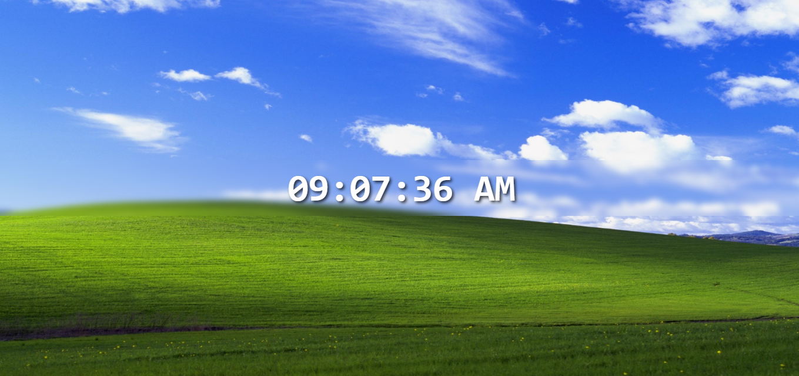

# ⏰ Digital Clock

Este é um projeto de **Relógio Digital** desenvolvido em **React**, que exibe a hora atual atualizando a cada segundo. A interface apresenta um fundo estilizado e um efeito de desfoque para destacar o relógio.

## 🛠 Tecnologias Utilizadas

- React.js  
- JavaScript (ES6+)  
- CSS Puro  

## 🎨 Funcionalidades

- Exibição da hora no formato **12 horas (AM/PM)**.  
- Atualização dinâmica do horário a cada segundo.  
- Estilização com **efeito de desfoque no fundo**.  
- **Wallpaper clássico do Windows XP** como fundo.  

## 📷 Prévia do Projeto

## 📜 Licença

Este projeto está sob a licença **MIT**. Veja o arquivo [LICENSE](./LICENSE) para mais detalhes.